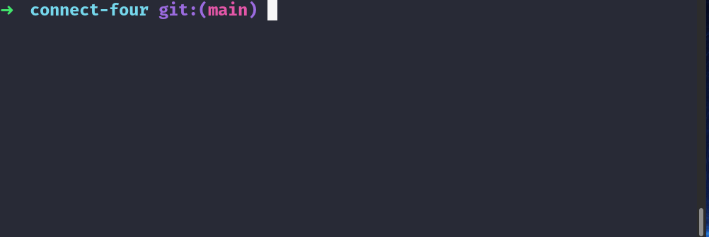

# Connect Four C++

This is a simple Connect Four app written in some basic C++.

## Installation


```bash
git clone git@github.com:daniel-schroeder-dev/cpp-connect-four.git
cd cpp-connect-four
```

## Usage

If you're running Linux, you may be able to just run the executable that's included:

```bash
./connect_four
```

Otherwise, you can compile the `.cpp` file and run that using whatever compiler you have on your machine. Here's how I do it with `g++`:

```bash
g++ connect_four.cpp -o connect_four && ./connect_four
```



## Contributing
Pull requests are welcome. For major changes, please open an issue first to discuss what you would like to change.

## License
[MIT](https://choosealicense.com/licenses/mit/)
